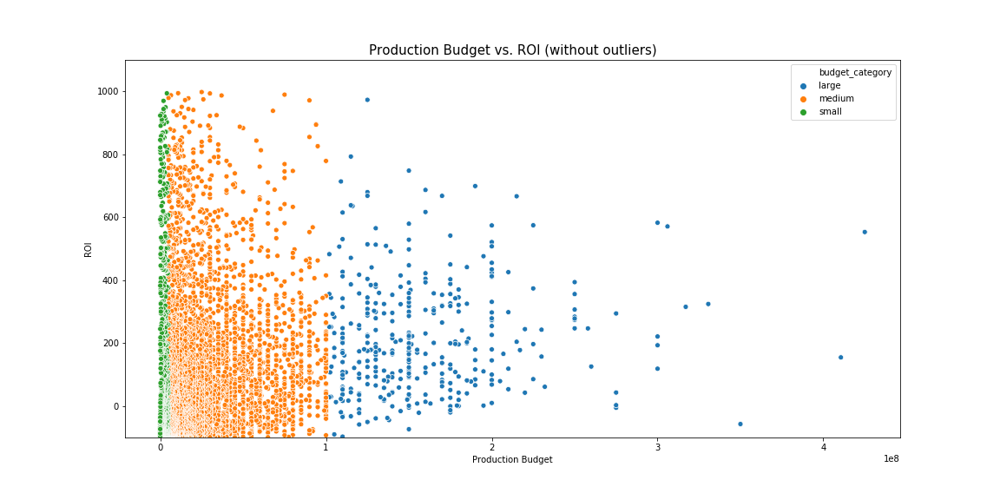
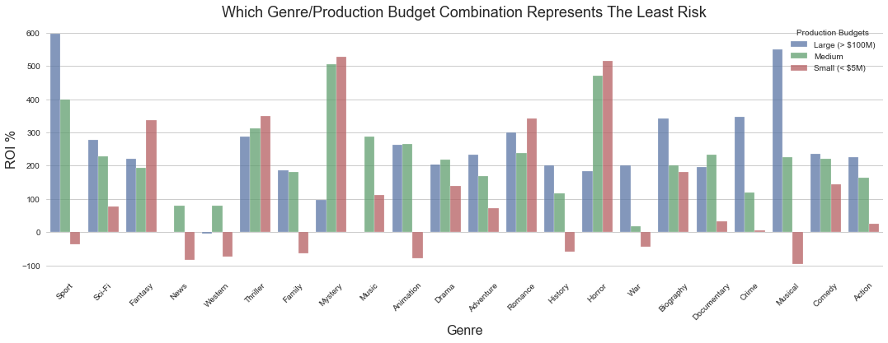
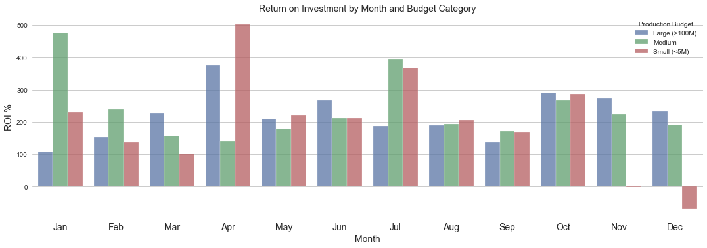

# The Launch of Microsoft Studios Film Division
**Author**: [Tim Hintz](mailto:tjhintz@gmail.com) [Aidan Coco](aidancoco@gmail.com)

## Overview

The current research uses exploratory data analysis to investigate the factors relevant to making a successful movie. We found that there are three key factors to consider:
- How much does it cost to produce a movie?
- Which genres are the most successful?
- When should a studio release their movie?

Our results indicate that Microsoft should produce predominantly high budget sports and musical films. Microsoft should release them in the months of April, October and November to maximise predicted ROI. Microsoft should also be looking to invest in low budget Thriller,Crime and Mystery films for a decent chance of earning extrememly high returns on the investment. As low budget movies typically do better on April, July and October, these are the best months for Microsoft to release them on.

### Business Problem

Microsoft would like to start it’s own movie studio. However, they do not know anything about the movie industry. Here, we explore relevant data concerning the movie industry. In particular, our focus was on how best to minimise risk while opening up the potential for very large returns on investment. 

### The Data

In the folder `zippedData` are movie datasets from:

* Box Office Mojo
* IMDB
* Rotten Tomatoes
* TheMovieDB.org

In the folder `rawdata` there are cleaned and wrangled data sets used in the final analysis

### Methods

This research utilized the application of descriptive statistics and data visualisations to motivate statistical inference on the optimal strategy for making a movie. Due to a changing market place, we did not include data points taken before 2010 and since 2020 had yet to finish, we also omitted any move released after 2019.

### Results

#### The risk of investment does not scale linearly

Low and medium budget films have a noticably wider range of outcomes. Low and medium budget films have more negative datapoints. Larger budget films offer a more consistent roi

#### There is a signeficant risk associated with certain genres

During our research we found that some genres are particulalry risky investments in the current market. Westerns and News based movies seem to do badly especially when the budget for them is low. 

On the other hand low budget fantasy, mystery and horror do relatively well. 

Interpreting the first sections findings we think the soundest strategy is an investment in high budget musicals and sports movies with a modertate investment in low budget horror, thriller and crimes movies.
#### The Budget and Genre Will Determine Best Time of Release

Finally, we examined the effect of month/seasonality on the ROI of movies released. From this chart, there is good evidence that there is a pattern on when high budget movies return the best profit. However, the evidence is not compelling and further research needs to be done. 

#### Conclusions

It is our opinion that if Microsoft wishes to get into the movie industry, the safest way to do so would be to invest heavily into large, blockbuster type films particularly Musicals and Sports based movies to do well. In addition, they should aim to release those movies in either April, October or December to have the greatest expected ROI.

However, smaller budget films have almost a 15% chance of returning over 1000%. This is something that should be investigated further. In particular, Horror, Crime and Mystery films can yeild an enormous ROI under some currently undiscovered conditions. It is our opinion that any studio should be investing in lower budget indie films in order to maximise their chances of returning on their investment.

#### Further Research

- Our data is only a small subset of the available information. Supplementary data should be used in further analysis in order to: 
    - Try to replicate our findings
    - Perform more powerful statistical analysis

- The seaonality of movie success is likely due to social factors rather than environmtal ones. We would like to look closer into how the awars ceremonies influece the success of a movie.

- All of our budget and revenue data is an estimate based on crowed sourced websites. The presentation of revenue streams and production budgets is opaque. Therefore, we would ask Microsoft to allow us to purchase that information directly from the studios involved.

- We did not look into the effect of celebrity on the success of a movie. A paper published in 2017 (François A. Carrillat et al. Debates and assumptions about motion picture performance: a meta-analysis, Journal of the Academy of Marketing Science (2017). DOI: 10.1007/s11747-017-0561-6) gave strong evidence that most important factors involved in a movies success are
    - Fame of the Actors
    - Marketing Budget
    - Number of screens released on
    
